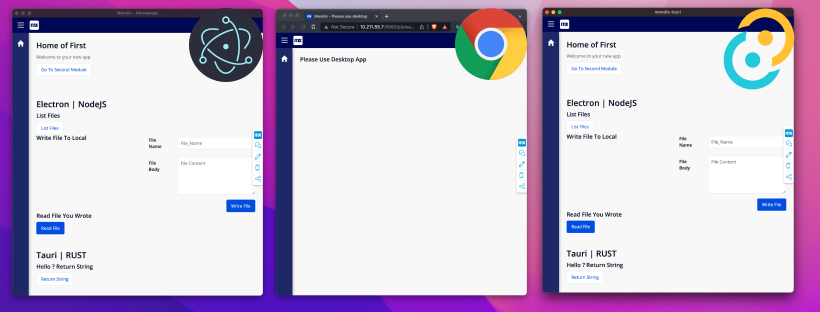
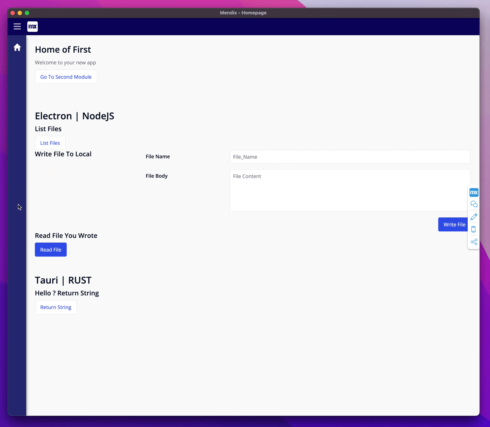
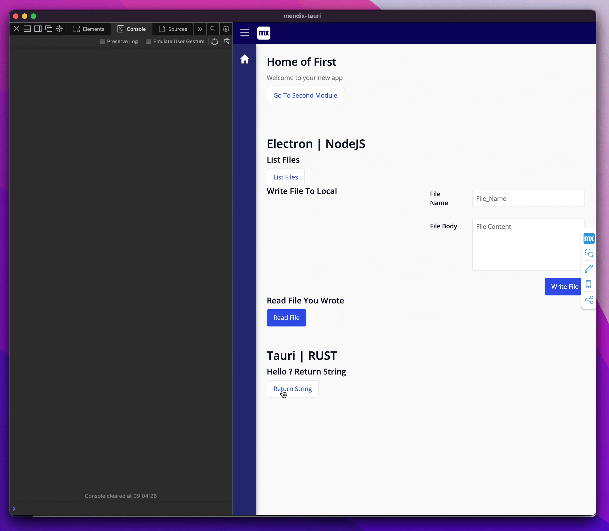

# Mendix | Desktop | Electron | Tauri

> **Note** This was part of a crafting day project and is at best nothing. This breaks all the philosaphy of Low Code, but it was fun so 🤷🏽‍♀️



<hr/>

Uses:

- [Tauri/Rust](https://tauri.studio/)
- [Electron](https://tauri.studio/)
- Turborepo
- Vite (for Electron builds)

<hr/>

This is a Monorrepo powered by [Turborepo](https://github.com/vercel/turborepo), that allows you to run a Mendix App as a [Electron](https://www.electronjs.org/) Desktop app or [Tauri](https://tauri.studio/) Desktop App.

The idea here is that you package and ship your Mendix app as normal, as in the app is hosted in the cloud, but you can run Node or Rust Code, by accessing the app in their respective wrappers. With this you can run Native Rust code or NodeJs packages from your Mendix App with Nanoflows.

The Web app will auto redirect to a default page asking the user to use the Desktop Apps if viewd in a browser.

### Electron Example

In the example I list all files in a folder from a Microflow. I also write create a `.txt` file to the system and then read it back.



### Rust Example

In the example I call a Rust function and return a `hello` string in the console



<hr/>

## How it works

### Electron / Javascript

In the preload I pass some common NodeJs packages safely over the `contextBridge` and expose it in the electron main world.

Currently I expose the following from Core NodeJs

```ts
import * as util from "util";
import * as fs from "fs";
import * as path from "path";
import * as child_process from "child_process";
```

### Tauri / Rust

This is a very basic example with zero real changes done after the initial setup from the cli.

I have added a simple Rust function that you can call from a Nanoflow.

<hr/>

## How to Play with it

### General

Use Node LTS, and run `npm install` to install dependencies. Then run `npm run dev` to run the 2 desktop apps.
In the file `MendixDemoApp.zip` you will find the test Mendix project (9.6.0).

### Electron

#### Set Ports

To set the Electron Process to listen to the correct port, navigate to `mdet-repo/apps/electron/layers/main/src/mainWindow.ts` and point it to your mendix app.

```ts
const pageUrl = import.meta.env.DEV
  ? "http://10.211.55.7:8080/"
  : "http://www.google.com";
```

#### Some Node Code

Navigate to `mdet-repo/apps/electron/layers/preload/src/index.ts` and add Node package there. This will add it to the window object that you can access in a Mendix Nanoflow.

### Rust

Navigate to `mdet-repo/apps/tauri/src-tauri/tauri.conf.json` and change `devPath` to your mendix Port number.

<details >
  <summary>Add Auto Redirect to App</summary>
 <ul>
 <li>
 
 Add this code to your custom `index.html`

 </li>

```html
<script>
  /**
   * Helper Function to Debounce the MutationObserver
   */
  function debounce(func, timeout = 300) {
    let timer;
    return (...args) => {
      clearTimeout(timer);
      timer = setTimeout(() => {
        func.apply(this, args);
      }, timeout);
    };
  }
  /**
   * Because its a SPA and Mendix does not do Normal Navigation.
   */
  let invoke = window.__TAURI__;
  let isDesktopApp = window.mendixElectron || window.__TAURI__;

  function callBack() {
    if (
      !window.history.state.pageInfo.formParams.path.includes(
        "PleaseUseDesktop"
      )
    ) {
      location.replace("/p/pleaseusedesktop");
    }
  }

  const observer = new MutationObserver(debounce(callBack, 500));
  const config = { childList: true, attributes: false, subtree: true };

  if (!isDesktopApp) {
    observer.observe(document, config);
  }
</script>
```

This will see if Electron or Tauri has been added to the `window` object. If not it will redirect the browser to a URL `pleaseusedesktop`

 </ul>
</details>

## Things to Note

I have only tested this on macOS

## Prior work

Most of this code is generously borrowed from the following

- [yerba](https://github.com/TheoBr/yerba) by TheoBr
- [vite-electron-builder](https://github.com/cawa-93/vite-electron-builder)
- [Turborepo basic example](https://github.com/vercel/turborepo/tree/main/examples/basic)
